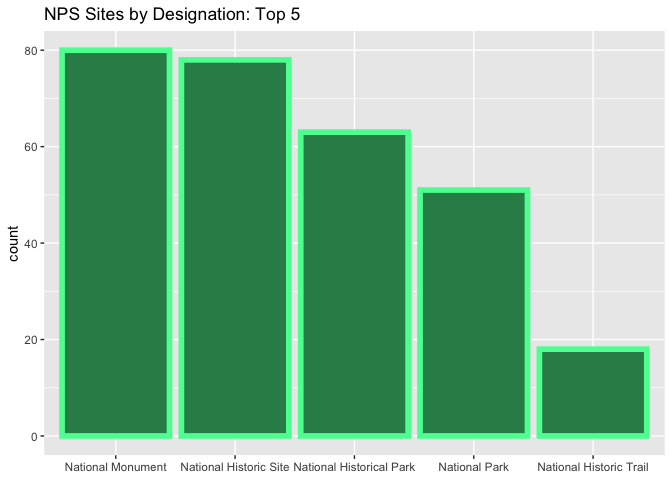
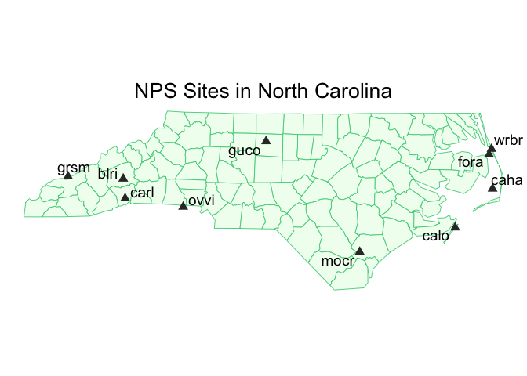
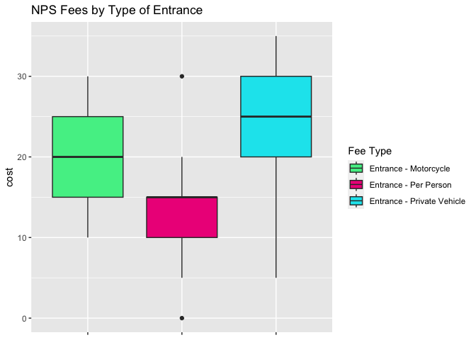
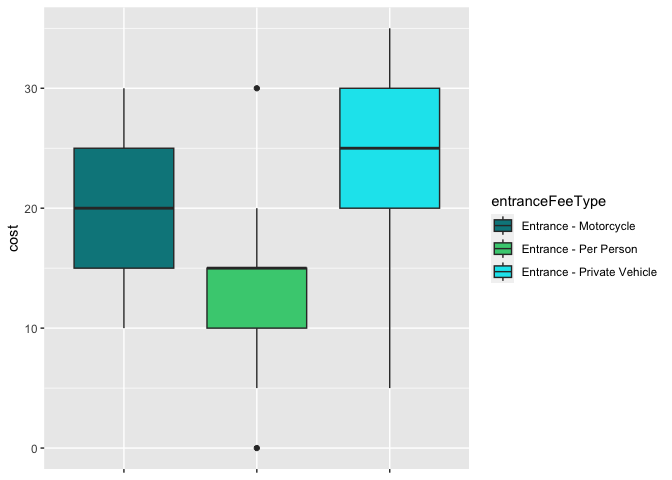

NPS API Vignette
================

- [Requirements](#requirements)
- [API Interaction Functions](#api-interaction-functions)
  - [get_NPS_parks](#get_nps_parks)
  - [get_NPS_activities](#get_nps_activities)
  - [get_NPS_campgrounds](#get_nps_campgrounds)
- [Exploratory Data Analysis](#exploratory-data-analysis)
  - [NPS Sites in North Carolina](#nps-sites-in-north-carolina)
  - [NPS Sites with Climbing and
    Swimming](#nps-sites-with-climbing-and-swimming)
  - [Campgrounds Amenities at grsm](#campgrounds-amenities-at-grsm)

This document demonstrates how to retrieve data from the National Parks
Service (NPS)
[API](https://www.nps.gov/subjects/developer/api-documentation.htm). The
NPS API provides access to data about NPS sites and their activities,
campgrounds, events, photos, and more. In this vignette, I build
functions to interact with and pull data from the API’s endpoints. I
then use the functions to perform some exploratory data analysis.


# Requirements

# API Interaction Functions

## get_NPS_parks

This function interacts with the parks endpoint to retrieve parks
located in your state. The required input is `key` and the optional
input is `states`, a character vector of two-letter state codes
(e.g. `c("NC", "MI")`).

The output is a tibble of NPS sites. If no state(s) is supplied, the
function will return sites in all states. There are numerous site
designations within NPS (other than “National Park”) and descriptions
for each designation can be found
[here](https://www.nps.gov/goga/planyourvisit/designations.htm).

``` r
get_NPS_parks <- function(key, states = NULL){
  if(is.null(states)){
    url <- paste0("https://developer.nps.gov/api/v1/parks?api_key=",
                  key,
                  "&limit=10000")
  }
  
  if(!is.null(states)){
    url <- paste0("https://developer.nps.gov/api/v1/parks?api_key=",
                  key,
                  "&stateCode=",
                  paste(states, collapse = ","),
                  "&limit=10000")
  }

query <- GET(url)
results <- fromJSON(rawToChar(query$content))$data |>
  select(fullName, parkCode, states, designation, latitude, longitude) |>
  mutate(latitude = as.numeric(latitude), longitude = as.numeric(longitude)) |>
  as_tibble()

return(results)
}
```

## get_NPS_activities

This function interacts with the activities/parks endpoint to retrieve
parks associated with your activities. The required inputs are `key` and
`activities`, a character vector of activities (e.g. \`c(“Hiking”,
“Horse Trekking”)). The output is a tibble of NPS sites related to the
input activities.

``` r
get_NPS_activities <- function(key, activities){
  acts <- paste(activities, collapse = ",")
  acts <- sub(" ", "%20", acts)
  
  url <- paste0("https://developer.nps.gov/api/v1/activities/parks?api_key=",
                key,
                "&q=",
                acts,
                "&limit=10000")
  
  query <- GET(url)
  results <- fromJSON(rawToChar(query$content))$data$parks
  
  activity <- c()
  for (i in 1:length(activities)){
    y <- rep(activities[i],
             nrow(results[[i]]))
    activity <- append(activity, y)
  }
  
  results <- results |>
    bind_rows() |>
    cbind(activity) |>
    select(fullName, parkCode, states, activity) |>
    as_tibble()
  
  return(results)
}
```

These are the categories of activities defined by NPS:

``` r
get_activities <- GET(paste0("https://developer.nps.gov/api/v1/activities?api_key=",
                             my_key))
NPS_activities <- fromJSON(rawToChar(get_activities$content))$data$name
NPS_activities
```

    ##  [1] "Arts and Culture"      "Astronomy"             "Auto and ATV"         
    ##  [4] "Biking"                "Boating"               "Camping"              
    ##  [7] "Canyoneering"          "Caving"                "Climbing"             
    ## [10] "Compass and GPS"       "Dog Sledding"          "Fishing"              
    ## [13] "Flying"                "Food"                  "Golfing"              
    ## [16] "Guided Tours"          "Hands-On"              "Hiking"               
    ## [19] "Horse Trekking"        "Hunting and Gathering" "Ice Skating"          
    ## [22] "Junior Ranger Program" "Living History"        "Museum Exhibits"      
    ## [25] "Paddling"              "Park Film"             "Playground"           
    ## [28] "SCUBA Diving"          "Shopping"              "Skiing"               
    ## [31] "Snorkeling"            "Snow Play"             "Snowmobiling"         
    ## [34] "Snowshoeing"           "Surfing"               "Swimming"             
    ## [37] "Team Sports"           "Tubing"                "Water Skiing"         
    ## [40] "Wildlife Watching"

## get_NPS_campgrounds

This function interacts with the campgrounds endpoint to retrieve data
about amenities at campgrounds in your park. The preceding function,
`get_NPS_codes`, retrieves park codes for all sites. It can be used to
look up a park code and is used in the main campgrounds function.

``` r
get_NPS_codes <- function(key) {
  url <- paste0("https://developer.nps.gov/api/v1/parks?api_key=",
                key,
                "&limit=10000")
  query <- GET(url)
  results <- fromJSON(rawToChar(query$content))$data
  results |>
    select(fullName, parkCode, states) |>
    as_tibble()
}
```

Here, I look up the `parkCode` for each of my parks of interest – the
Smoky Mountains and the New River Gorge.

``` r
all_codes <- get_NPS_codes(my_key) 
my_codes <- all_codes |>
  filter(grepl("Joshua Tree|New River", all_codes$fullName))
my_codes
```

    ## # A tibble: 2 × 3
    ##   fullName                                 parkCode states
    ##   <chr>                                    <chr>    <chr> 
    ## 1 Joshua Tree National Park                jotr     CA    
    ## 2 New River Gorge National Park & Preserve neri     WV

Now for the `get_NPS_campgrounds` function, the required input is `key`
and the optional input is `park_codes`, a character vector of park codes
(e.g. c(“jotr”, “neri”)).

``` r
get_NPS_campgrounds <- function(key, park_codes = NULL){
  parks <- get_NPS_codes(key)
  
  if(is.null(park_codes)){
    url <- paste0("https://developer.nps.gov/api/v1/campgrounds?api_key=",
                  key,
                  "&limit=10000")
  }
  
  if(!is.null(park_codes)){
    url <- paste0("https://developer.nps.gov/api/v1/campgrounds?api_key=",
                  key,
                  "&parkCode=",
                  paste(park_codes, collapse = ","),
                  "&limit=10000")
  }
  
  query <- GET(url)
  camps <- fromJSON(rawToChar(query$content))$data |>
    select(name, parkCode) |>
    left_join(parks)
  results <- cbind(camps, fromJSON(rawToChar(GET(url)$content))$data$amenities)|>
    as_tibble()
  
  return(results)
}
```

``` r
get_NPS_fees <- function(key, park_codes){
  url <- paste0("https://developer.nps.gov/api/v1/feespasses?api_key=",
                key,
                "&parkCode=",
                paste(park_codes, collapse = ","),
                "&limit=10000")
  query <- GET(url)
  fromJSON(rawToChar(query$content))$data$fees
}
```

# Exploratory Data Analysis


## NPS Sites in North Carolina

First, let’s pull data on all NPS sites in North Carolina using the
`get_NPS_parks` function.

``` r
NC_parks <- get_NPS_parks(my_key, "NC")
NC_parks
```

    ## # A tibble: 12 × 6
    ##    fullName                                     parkCode states    desig…¹ latit…² longi…³
    ##    <chr>                                        <chr>    <chr>     <chr>     <dbl>   <dbl>
    ##  1 Appalachian National Scenic Trail            appa     CT,GA,MA… Nation…    40.4   -76.4
    ##  2 Blue Ridge Parkway                           blri     NC,VA     Parkway    35.6   -82.5
    ##  3 Cape Hatteras National Seashore              caha     NC        Nation…    35.4   -75.7
    ##  4 Cape Lookout National Seashore               calo     NC        Nation…    34.8   -76.3
    ##  5 Carl Sandburg Home National Historic Site    carl     NC        Nation…    35.3   -82.5
    ##  6 Fort Raleigh National Historic Site          fora     NC        Nation…    35.9   -75.7
    ##  7 Great Smoky Mountains National Park          grsm     NC,TN     Nation…    35.6   -83.5
    ##  8 Guilford Courthouse National Military Park   guco     NC        Nation…    36.1   -79.8
    ##  9 Moores Creek National Battlefield            mocr     NC        Nation…    34.5   -78.1
    ## 10 Overmountain Victory National Historic Trail ovvi     NC,SC,TN… Nation…    35.1   -81.4
    ## 11 Trail Of Tears National Historic Trail       trte     AL,AR,GA… Nation…    36.1   -89.7
    ## 12 Wright Brothers National Memorial            wrbr     NC        Nation…    36.0   -75.7
    ## # … with abbreviated variable names ¹​designation, ²​latitude, ³​longitude

### What types (designations) of NPS sites are present in North Carolina?

``` r
NC_parks |>
  group_by(designation) |>
  summarise(count = n()) |>
  arrange(desc(count))
```

    ## # A tibble: 9 × 2
    ##   designation             count
    ##   <chr>                   <int>
    ## 1 National Historic Site      2
    ## 2 National Historic Trail     2
    ## 3 National Seashore           2
    ## 4 National Battlefield        1
    ## 5 National Memorial           1
    ## 6 National Military Park      1
    ## 7 National Park               1
    ## 8 National Scenic Trail       1
    ## 9 Parkway                     1

``` r
NC <- NC_parks |>
  filter(parkCode != "trte", parkCode != "appa")

NC_map <- st_read(system.file("shape/nc.shp", package="sf"))
```

    ## Reading layer `nc' from data source 
    ##   `/Library/Frameworks/R.framework/Versions/4.2-arm64/Resources/library/sf/shape/nc.shp' 
    ##   using driver `ESRI Shapefile'
    ## Simple feature collection with 100 features and 14 fields
    ## Geometry type: MULTIPOLYGON
    ## Dimension:     XY
    ## Bounding box:  xmin: -84.32385 ymin: 33.88199 xmax: -75.45698 ymax: 36.58965
    ## Geodetic CRS:  NAD27

``` r
ggplot(NC_map) +
  geom_sf(color = "seagreen3", fill = "honeydew", linewidth = 0.3) +
  geom_point(data = NC, mapping = aes(x = longitude,
                                      y = latitude),
             color = "grey20",
             shape = 17,
             size = 3) +
  ggrepel::geom_text_repel(data = NC, aes(x = longitude,
                                          y = latitude,
                                          label = parkCode),
                           size = 5) +
  theme_void() +
  labs(title = "NPS Sites in North Carolina") +
  theme(plot.title = element_text(hjust = 0.5, size = 20))
```

<!-- -->

``` r
all_parks <- get_NPS_parks(my_key)
all_des <- all_parks |>
  group_by(designation) |>
  filter(!designation == "") |>
  summarise(count = n()) |>
  arrange(desc(count))
all_des
```

    ## # A tibble: 46 × 2
    ##    designation              count
    ##    <chr>                    <int>
    ##  1 National Monument           80
    ##  2 National Historic Site      78
    ##  3 National Historical Park    63
    ##  4 National Park               51
    ##  5 National Historic Trail     18
    ##  6 National Memorial           17
    ##  7 National Recreation Area    16
    ##  8 National Battlefield        11
    ##  9 Park                        11
    ## 10 National Seashore           10
    ## # … with 36 more rows

``` r
all_des_5 <- all_des |>
  slice(1:5)

ggplot(data = all_des_5, aes(x = reorder(designation, -count))) +
         geom_col(aes(y = count), color = "seagreen1", linewidth = 2, fill = "seagreen4") +
  xlab(NULL) +
  ylab("count") +
  labs(title = "NPS Sites by Designation: Top 5")
```

<!-- -->

## NPS Sites with Climbing and Swimming

Next, let’s use the `get_NPS_activities` function to pull data on all
parks with “Climbing” and/or “Swimming” recorded as possible activities.

``` r
climb_swim <- get_NPS_activities(my_key, c("Climbing", "Swimming"))
climb_swim
```

    ## # A tibble: 91 × 4
    ##    fullName                                         parkCode states activity
    ##    <chr>                                            <chr>    <chr>  <chr>   
    ##  1 Acadia National Park                             acad     ME     Climbing
    ##  2 Aniakchak National Monument & Preserve           ania     AK     Climbing
    ##  3 Arches National Park                             arch     UT     Climbing
    ##  4 Big South Fork National River & Recreation Area  biso     KY,TN  Climbing
    ##  5 Black Canyon Of The Gunnison National Park       blca     CO     Climbing
    ##  6 Canyonlands National Park                        cany     UT     Climbing
    ##  7 Capitol Reef National Park                       care     UT     Climbing
    ##  8 Catoctin Mountain Park                           cato     MD     Climbing
    ##  9 Chickamauga & Chattanooga National Military Park chch     GA,TN  Climbing
    ## 10 City Of Rocks National Reserve                   ciro     ID     Climbing
    ## # … with 81 more rows

``` r
climb_swim |>
  group_by(activity) |>
  summarise(count = n())
```

    ## # A tibble: 2 × 2
    ##   activity count
    ##   <chr>    <int>
    ## 1 Climbing    39
    ## 2 Swimming    52

``` r
climb_swim_states <- climb_swim |>
  separate_rows(states, sep = ",")

ggplot(data = climb_swim_states, aes(x = states)) + 
  geom_bar(aes(fill = activity)) +
  scale_fill_manual(values = c("grey10", "turquoise3")) +
  theme(axis.text.x = element_text(angle = 90)) +
  ylab("count of NPS sites") +
  xlab("state") +
  labs(title = "NPS Sites with Climbing and/or Swimming by State")
```

<!-- -->

``` r
climb_and_swim <- climb_swim |>
  group_by(fullName) |>
  filter(n() > 1) |>
  select(-activity) |>
  distinct(fullName, states)

climb_and_swim
```

    ## # A tibble: 9 × 2
    ## # Groups:   fullName [9]
    ##   fullName                                        states
    ##   <chr>                                           <chr> 
    ## 1 Acadia National Park                            ME    
    ## 2 Big South Fork National River & Recreation Area KY,TN 
    ## 3 Delaware Water Gap National Recreation Area     NJ,PA 
    ## 4 Glacier National Park                           MT    
    ## 5 Great Sand Dunes National Park & Preserve       CO    
    ## 6 Little River Canyon National Preserve           AL    
    ## 7 Olympic National Park                           WA    
    ## 8 Pictured Rocks National Lakeshore               MI    
    ## 9 Yosemite National Park                          CA

## Campgrounds Amenities at grsm

``` r
my_camps <- get_NPS_campgrounds(my_key, "grsm")
my_camps
```

    ## # A tibble: 13 × 18
    ##    name     parkC…¹ fullN…² states trash…³ toilets inter…⁴ showers cellP…⁵ laundry amphi…⁶
    ##    <chr>    <chr>   <chr>   <chr>  <chr>   <list>  <chr>   <list>  <chr>   <chr>   <chr>  
    ##  1 Abrams … grsm    Great … NC,TN  "Yes -… <chr>   "No"    <chr>   "No"    "No"    "No"   
    ##  2 Balsam … grsm    Great … NC,TN  "Yes -… <chr>   "No"    <chr>   "No"    "No"    "Yes -…
    ##  3 Big Cre… grsm    Great … NC,TN  "Yes -… <chr>   "No"    <chr>   "No"    "No"    "No"   
    ##  4 Cades C… grsm    Great … NC,TN  "Yes -… <chr>   "No"    <chr>   "No"    "No"    "Yes -…
    ##  5 Cades C… grsm    Great … NC,TN  "Yes -… <chr>   "No"    <chr>   "No"    "No"    "Yes -…
    ##  6 Cataloo… grsm    Great … NC,TN  "Yes -… <chr>   "No"    <chr>   "No"    "No"    "No"   
    ##  7 Cosby C… grsm    Great … NC,TN  "Yes -… <chr>   "No"    <chr>   "No"    "No"    "Yes -…
    ##  8 Deep Cr… grsm    Great … NC,TN  "Yes -… <chr>   "No"    <chr>   "No"    "No"    "No"   
    ##  9 Elkmont… grsm    Great … NC,TN  "Yes -… <chr>   "No"    <chr>   "No"    "No"    "Yes -…
    ## 10 Elkmont… grsm    Great … NC,TN  "Yes -… <chr>   "No"    <chr>   "No"    "No"    "Yes -…
    ## 11 Look Ro… grsm    Great … NC,TN  "Yes -… <chr>   "No"    <chr>   "No"    "No"    "No"   
    ## 12 Smokemo… grsm    Great … NC,TN  "Yes -… <chr>   "No"    <chr>   "No"    "No"    "No"   
    ## 13 Smokemo… grsm    Great … NC,TN  ""      <chr>   ""      <chr>   ""      ""      ""     
    ## # … with 7 more variables: dumpStation <chr>, campStore <chr>,
    ## #   staffOrVolunteerHostOnsite <chr>, potableWater <list>, iceAvailableForSale <chr>,
    ## #   firewoodForSale <chr>, foodStorageLockers <chr>, and abbreviated variable names
    ## #   ¹​parkCode, ²​fullName, ³​trashRecyclingCollection, ⁴​internetConnectivity,
    ## #   ⁵​cellPhoneReception, ⁶​amphitheater

``` r
my_camps_heat <- my_camps |>
  slice(1:12) |>
  select(name, cellPhoneReception, potableWater, toilets, trashRecyclingCollection, campStore, foodStorageLockers, firewoodForSale) |>
  mutate(potableWater = unlist(potableWater)) |>
  mutate(toilets = unlist(toilets)) |>
  pivot_longer(!name, names_to = "var", values_to = "value") |>
  mutate(value = recode(value, 
                        "No" = "0",
                        "No water" = "0",
                        "Yes - year round" = "1",
                        "Yes - seasonal" = "0.5",
                        "Flush Toilets - year round" = "1",
                        "Flush Toilets - seasonal" = "0.5")) |>
  mutate(value = as.numeric(value))

ggplot(my_camps_heat, aes(x = name, y = var, fill = value)) +
  geom_tile() +
  scale_fill_gradient(low = "grey1", high = "turquoise1", name = "") +
  theme(axis.text.x = element_text(angle = 45, hjust = 1)) +
  xlab(NULL) + ylab(NULL) +
  labs(title = "Campground Amenities:
Great Smoky Mountains National Park")
```

<!-- -->

``` r
all_codes <- as.vector(get_NPS_codes(my_key)$parkCode)
fees <- bind_rows(get_NPS_fees(my_key, all_codes)) |>
  as_tibble() |>
  select(entranceFeeType, cost) |>
  mutate(cost = as.numeric(cost)) |>
  filter(entranceFeeType == "Entrance - Private Vehicle"|
         entranceFeeType == "Entrance - Motorcycle"|
         entranceFeeType == "Entrance - Per Person")
```

``` r
fees |>
  group_by(entranceFeeType) |>
  summarise(averageCost= mean(cost))
```

    ## # A tibble: 3 × 2
    ##   entranceFeeType            averageCost
    ##   <chr>                            <dbl>
    ## 1 Entrance - Motorcycle             21.3
    ## 2 Entrance - Per Person             13.5
    ## 3 Entrance - Private Vehicle        25.8

``` r
ggplot(data = fees, aes(x = entranceFeeType, y = cost)) +
  geom_boxplot(aes(fill = entranceFeeType)) +
  xlab(NULL) +
  theme(axis.text.x = element_blank()) +
  scale_fill_manual(values = c("turquoise4", "seagreen3", "turquoise2"))
```

<!-- -->
