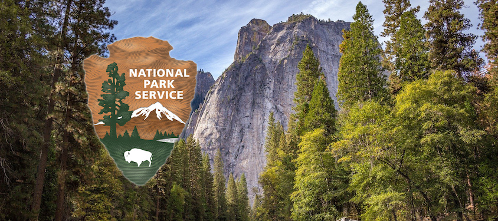
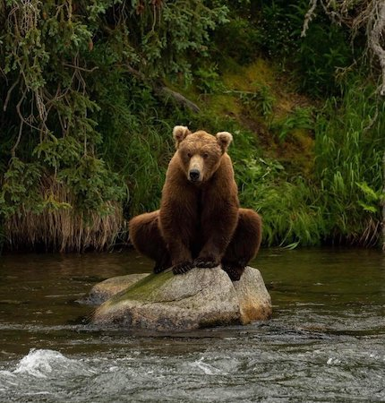
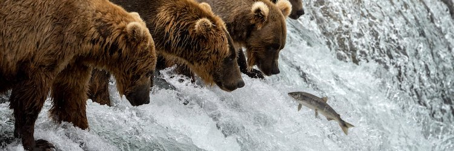
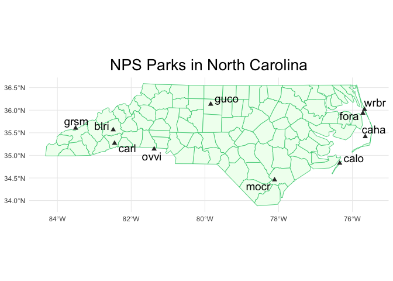
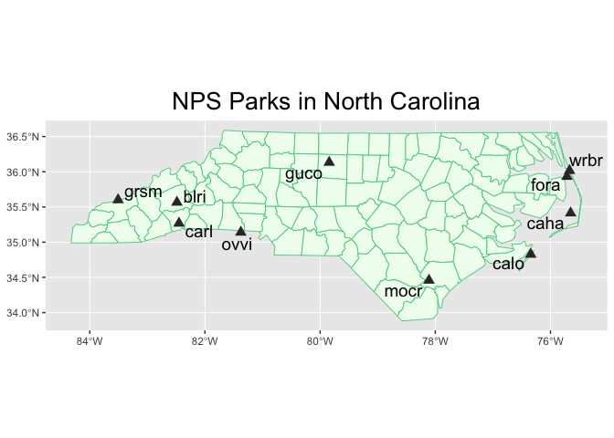
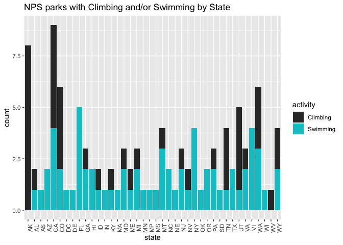

National Park Service API Vignette
================
by Sarah Pagan

- [Overview](#overview)
- [Requirements](#requirements)
- [API Interaction Functions](#api-interaction-functions)
  - [get_NPS_parks](#get_nps_parks)
  - [get_NPS_activities](#get_nps_activities)
  - [get_NPS_campgrounds](#get_nps_campgrounds)
  - [get_NPS_fees](#get_nps_fees)
- [Exploratory Data Analysis](#exploratory-data-analysis)
  - [NPS Parks in North Carolina](#nps-parks-in-north-carolina)
  - [National Designation Statistics](#national-designation-statistics)
  - [NPS Parks with Climbing and
    Swimming](#nps-parks-with-climbing-and-swimming)
  - [Campground Amenities at grsm](#campground-amenities-at-grsm)
  - [Entrance Fees](#entrance-fees)



# Overview

This document demonstrates how to retrieve and summarize data from the
United States National Park Service (NPS)
[API](https://www.nps.gov/subjects/developer/api-documentation.htm). The
NPS API provides access to data about official NPS parks and their
activities, campgrounds, events, photos, and more. In this vignette, I
build functions to interact with four of the API’s endpoints. I then use
these functions to perform some exploratory data analysis.

# Requirements

To retrieve data from the NPS API you will need to sign up for a free
API key at the [Get Started with the NPS
API](https://www.nps.gov/subjects/developer/get-started.htm) web page.
Additional, helpful documentation about the NPS API is located
[here](https://www.nps.gov/subjects/developer/api-documentation.htm).

To develop my API interaction functions, I used the following packages:

`httr`

`jsonlite`

`dplyr`

I also used these packages to manipulate and visualize data:

`stringr`

`tidyr`

`ggplot2`

`sf`

# API Interaction Functions



## get_NPS_parks

This function interacts with the parks endpoint to retrieve NPS parks
located in your state. The required input is `key` and the optional
input is `states`, a character vector of two-letter state codes
(e.g. `c("NC", "MI")`).

The output is a tibble of NPS parks. If no state(s) is supplied, the
function will return parks in all states. One variable included in the
output is `designation`. There are numerous site designations (other
than “National Park”) and descriptions for each designation can be found
[here](https://www.nps.gov/goga/planyourvisit/designations.htm).

``` r
get_NPS_parks <- function(key, states = NULL){
  if(is.null(states)){
    url <- paste0("https://developer.nps.gov/api/v1/parks?api_key=",
                  key,
                  "&limit=10000")
  }
  
  else{
    url <- paste0("https://developer.nps.gov/api/v1/parks?api_key=",
                  key,
                  "&stateCode=",
                  paste(states, collapse = ","),
                  "&limit=10000")
  }

query <- GET(url) #get data from api
results <- fromJSON(rawToChar(query$content))$data |>
  #select vars
  select(fullName, parkCode, states, designation, latitude, longitude) |>
  #coerce longitude and latitude to numeric
  mutate(latitude = as.numeric(latitude), longitude = as.numeric(longitude)) |>
  as_tibble()

return(results)
}
```

## get_NPS_activities

This function interacts with the activities/parks endpoint to retrieve
parks associated with your activities. The required inputs are `key` and
`activities`, a character vector of activities
(e.g. `c("Hiking", "Horse Trekking")`). The output is a tibble of NPS
parks related to the input activities.

``` r
get_NPS_activities <- function(key, activities){
  acts <- paste(activities, collapse = ",")
  acts <- sub(" ", "%20", acts)
  
  url <- paste0("https://developer.nps.gov/api/v1/activities/parks?api_key=",
                key,
                "&q=",
                acts,
                "&limit=10000")
  
  query <- GET(url) #get data from api
  results <- fromJSON(rawToChar(query$content))$data$parks
  
  activity <- c() #build column for activity
  for (i in 1:length(activities)){
    y <- rep(activities[i],
             nrow(results[[i]]))
    activity <- append(activity, y)
  }
  
  results <- results |> 
    bind_rows() |>
    cbind(activity) |> #add activity column
    select(fullName, parkCode, states, activity) |> #select vars
    as_tibble()
  
  return(results)
}
```

For reference, here are the categories of activities defined by NPS:

``` r
get_activities <- GET(paste0("https://developer.nps.gov/api/v1/activities?api_key=", my_key))
NPS_activities <- fromJSON(rawToChar(get_activities$content))$data$name
NPS_activities
```

    ##  [1] "Arts and Culture"      "Astronomy"            
    ##  [3] "Auto and ATV"          "Biking"               
    ##  [5] "Boating"               "Camping"              
    ##  [7] "Canyoneering"          "Caving"               
    ##  [9] "Climbing"              "Compass and GPS"      
    ## [11] "Dog Sledding"          "Fishing"              
    ## [13] "Flying"                "Food"                 
    ## [15] "Golfing"               "Guided Tours"         
    ## [17] "Hands-On"              "Hiking"               
    ## [19] "Horse Trekking"        "Hunting and Gathering"
    ## [21] "Ice Skating"           "Junior Ranger Program"
    ## [23] "Living History"        "Museum Exhibits"      
    ## [25] "Paddling"              "Park Film"            
    ## [27] "Playground"            "SCUBA Diving"         
    ## [29] "Shopping"              "Skiing"               
    ## [31] "Snorkeling"            "Snow Play"            
    ## [33] "Snowmobiling"          "Snowshoeing"          
    ## [35] "Surfing"               "Swimming"             
    ## [37] "Team Sports"           "Tubing"               
    ## [39] "Water Skiing"          "Wildlife Watching"

## get_NPS_campgrounds

This function interacts with the campgrounds endpoint to retrieve data
about amenities at campgrounds in your park.

The preceding function, `get_NPS_codes`, retrieves park codes for all
parks. It can be used to look up the official code for your park and is
used in the main campgrounds function to join park names by `parkCode`.

``` r
get_NPS_codes <- function(key) {
  url <- paste0("https://developer.nps.gov/api/v1/parks?api_key=",
                key,
                "&limit=10000")
  
  query <- GET(url) #get data from api
  results <- fromJSON(rawToChar(query$content))$data |>
    select(fullName, parkCode, states) |> #select vars
    as_tibble()
  
  return(results)
}
```

Now for the `get_NPS_campgrounds` function, the required input is `key`
and the optional input is `park_codes`, a character vector of park codes
(e.g. `c("jotr", "neri")`).

``` r
get_NPS_campgrounds <- function(key, park_codes = NULL){
  parks <- get_NPS_codes(key) #get park names and codes
  
  if(is.null(park_codes)){
    url <- paste0("https://developer.nps.gov/api/v1/campgrounds?api_key=",
                  key,
                  "&limit=10000")
  }
  
  else{
    url <- paste0("https://developer.nps.gov/api/v1/campgrounds?api_key=",
                  key,
                  "&parkCode=",
                  paste(park_codes, collapse = ","),
                  "&limit=10000")
  }
  
  query <- GET(url) #get data from api
  
  #join campground names with park names and park codes
  camps <- fromJSON(rawToChar(query$content))$data |>
    select(name, parkCode) |>
    left_join(parks, by = "parkCode")
  
  #column bind camps data with amenities data
  results <- cbind(camps, fromJSON(rawToChar(GET(url)$content))$data$amenities)|>
    as_tibble()
  
  return(results)
}
```

## get_NPS_fees

This function interacts with the feespasses endpoint to retrieve data on
fees associated with your park. The required inputs are `key` and
`park_codes`, a character vector of park codes
(e.g. `c("jotr", "neri")`).

``` r
get_NPS_fees <- function(key, park_codes){
  url <- paste0("https://developer.nps.gov/api/v1/feespasses?api_key=",
                key,
                "&parkCode=",
                paste(park_codes, collapse = ","),
                "&limit=10000")
  
  query <- GET(url) #get data from api
  results <- fromJSON(rawToChar(query$content))$data$fees |>
    bind_rows()
  
  #if returned list is not empty (park has fees)
  if(length(results) > 0){
    results <- results |>
      select(entranceFeeType, cost) |> #select vars
      mutate(cost = as.numeric(cost)) #coerce cost to numeric
  }
  
  #stop if empty list is returned
  else{
    stop(message = "No fees!")
  }
  
  return(results)
}
```

# Exploratory Data Analysis



## NPS Parks in North Carolina

First, let’s pull data on all NPS parks in North Carolina using the
`get_NPS_parks` function.

``` r
NC_parks <- get_NPS_parks(my_key, "NC")
NC_parks
```

    ## # A tibble: 12 × 6
    ##    fullName           parkC…¹ states desig…² latit…³ longi…⁴
    ##    <chr>              <chr>   <chr>  <chr>     <dbl>   <dbl>
    ##  1 Appalachian Natio… appa    CT,GA… Nation…    40.4   -76.4
    ##  2 Blue Ridge Parkway blri    NC,VA  Parkway    35.6   -82.5
    ##  3 Cape Hatteras Nat… caha    NC     Nation…    35.4   -75.7
    ##  4 Cape Lookout Nati… calo    NC     Nation…    34.8   -76.3
    ##  5 Carl Sandburg Hom… carl    NC     Nation…    35.3   -82.5
    ##  6 Fort Raleigh Nati… fora    NC     Nation…    35.9   -75.7
    ##  7 Great Smoky Mount… grsm    NC,TN  Nation…    35.6   -83.5
    ##  8 Guilford Courthou… guco    NC     Nation…    36.1   -79.8
    ##  9 Moores Creek Nati… mocr    NC     Nation…    34.5   -78.1
    ## 10 Overmountain Vict… ovvi    NC,SC… Nation…    35.1   -81.4
    ## 11 Trail Of Tears Na… trte    AL,AR… Nation…    36.1   -89.7
    ## 12 Wright Brothers N… wrbr    NC     Nation…    36.0   -75.7
    ## # … with abbreviated variable names ¹​parkCode,
    ## #   ²​designation, ³​latitude, ⁴​longitude

### Which designation categories are represented by North Carolina’s NPS units?

North Carolina has 12 NPS units in total. It turns out it’s a pretty
diverse set of parks as well, including nine unique designations.

``` r
NC_parks |>
  group_by(designation) |>
  summarise(count = n()) |>
  arrange(desc(count))
```

    ## # A tibble: 9 × 2
    ##   designation             count
    ##   <chr>                   <int>
    ## 1 National Historic Site      2
    ## 2 National Historic Trail     2
    ## 3 National Seashore           2
    ## 4 National Battlefield        1
    ## 5 National Memorial           1
    ## 6 National Military Park      1
    ## 7 National Park               1
    ## 8 National Scenic Trail       1
    ## 9 Parkway                     1

### Where are North Carolina’s NPS units located?

The data pull from `get_NPS_parks` includes information on latitude and
longitude coordinates for each unit. I use this data to plot the parks
on a map of North Carolina below. I exclude the Trail Of Tears National
Historic Trail and the Appalachian National Scenic Trail since their
recorded geographic coordinates lie outside the state.

``` r
NC <- NC_parks |>
  filter(parkCode != "trte", parkCode != "appa")

NC_map <- st_read(system.file("shape/nc.shp", package="sf"), quiet = TRUE)
ggplot(NC_map) +
  geom_sf(color = "seagreen3", fill = "honeydew", linewidth = 0.3) +
  geom_point(data = NC, mapping = aes(x = longitude, y = latitude),
             color = "grey20", shape = 17, size = 2) +
  ggrepel::geom_text_repel(data = NC, aes(x = longitude, y = latitude, label = parkCode),
                           size = 5) +
  labs(title = "NPS Parks in North Carolina") +
  theme_minimal() +
  xlab(NULL) + ylab(NULL) +
  theme(plot.title = element_text(hjust = 0.5, size = 20))
```

<!-- -->

## National Designation Statistics

Let’s use the `get_NPS_parks` function again to pull data on all NPS
units. This time, I don’t specify a state and retrieve data on all NPS
parks in the nation.

``` r
all_parks <- get_NPS_parks(my_key)
all_parks
```

    ## # A tibble: 471 × 6
    ##    fullName           parkC…¹ states desig…² latit…³ longi…⁴
    ##    <chr>              <chr>   <chr>  <chr>     <dbl>   <dbl>
    ##  1 Abraham Lincoln B… abli    KY     "Natio…    37.6   -85.7
    ##  2 Acadia National P… acad    ME     "Natio…    44.4   -68.2
    ##  3 Adams National Hi… adam    MA     "Natio…    42.3   -71.0
    ##  4 African American … afam    DC     ""         38.9   -77.0
    ##  5 African Burial Gr… afbg    NY     "Natio…    40.7   -74.0
    ##  6 Agate Fossil Beds… agfo    NE     "Natio…    42.4  -104. 
    ##  7 Ala Kahakai Natio… alka    HI     "Natio…    19.1  -156. 
    ##  8 Alagnak Wild River alag    AK     "Wild …    59.1  -156. 
    ##  9 Alaska Public Lan… anch    AK     ""         61.2  -150. 
    ## 10 Alcatraz Island    alca    CA     ""         37.8  -122. 
    ## # … with 461 more rows, and abbreviated variable names
    ## #   ¹​parkCode, ²​designation, ³​latitude, ⁴​longitude

### Nationally, which NPS designation categories have the most units?

The National Monument and National Historic Site categories have the
most NPS units, followed by National Historical Park, National Park, and
National Historic Trail. I plot counts for these top five designations
below.

``` r
all_des <- all_parks |>
  group_by(designation) |>
  filter(!designation == "") |>
  summarise(count = n()) |>
  arrange(desc(count))

all_des
```

    ## # A tibble: 46 × 2
    ##    designation              count
    ##    <chr>                    <int>
    ##  1 National Monument           80
    ##  2 National Historic Site      78
    ##  3 National Historical Park    63
    ##  4 National Park               51
    ##  5 National Historic Trail     18
    ##  6 National Memorial           17
    ##  7 National Recreation Area    16
    ##  8 National Battlefield        11
    ##  9 Park                        11
    ## 10 National Seashore           10
    ## # … with 36 more rows

``` r
all_des_5 <- all_des |>
  slice(1:5)

ggplot(data = all_des_5, aes(x = reorder(designation, count))) +
         geom_col(aes(y = count), color = "seagreen1", linewidth = 1.5, fill = "seagreen4") +
  xlab(NULL) +
  ylab("count") +
  labs(title = "NPS parks by Designation: Top 5") +
  coord_flip()
```

<!-- -->

### Which states have the most National Monuments?

The National Monument designation category has the most NPS units,
therefore I break down the total count of National Monuments by state in
the summary table below. The southwest region of the country has the
highest concentration of monuments. Arizona leads the count with 13
monuments, and is followed by New Mexico with 9 monuments.

``` r
all_parks |>
  filter(designation == "National Monument") |>
  separate_rows(states) |>
  group_by(states) |>
  summarise(count = n()) |>
  arrange(desc(count)) |>
  slice(1:10)
```

    ## # A tibble: 10 × 2
    ##    states count
    ##    <chr>  <int>
    ##  1 AZ        13
    ##  2 NM         9
    ##  3 CA         7
    ##  4 NY         6
    ##  5 UT         6
    ##  6 CO         5
    ##  7 AL         3
    ##  8 VA         3
    ##  9 FL         2
    ## 10 GA         2

## NPS Parks with Climbing and Swimming

Next, let’s use the `get_NPS_activities` function to pull data on all
parks with “Climbing” and/or “Swimming” recorded as possible activities.

``` r
climb_swim <- get_NPS_activities(my_key, c("Climbing", "Swimming"))
climb_swim
```

    ## # A tibble: 91 × 4
    ##    fullName                           parkC…¹ states activ…²
    ##    <chr>                              <chr>   <chr>  <chr>  
    ##  1 Acadia National Park               acad    ME     Climbi…
    ##  2 Aniakchak National Monument & Pre… ania    AK     Climbi…
    ##  3 Arches National Park               arch    UT     Climbi…
    ##  4 Big South Fork National River & R… biso    KY,TN  Climbi…
    ##  5 Black Canyon Of The Gunnison Nati… blca    CO     Climbi…
    ##  6 Canyonlands National Park          cany    UT     Climbi…
    ##  7 Capitol Reef National Park         care    UT     Climbi…
    ##  8 Catoctin Mountain Park             cato    MD     Climbi…
    ##  9 Chickamauga & Chattanooga Nationa… chch    GA,TN  Climbi…
    ## 10 City Of Rocks National Reserve     ciro    ID     Climbi…
    ## # … with 81 more rows, and abbreviated variable names
    ## #   ¹​parkCode, ²​activity

### How many parks have climbing, and how many parks have swimming?

52 NPS parks have swimming listed as a possible activity, and 39 parks
have climbing listed as a possible activity.

``` r
climb_swim |>
  group_by(activity) |>
  summarise(count = n())
```

    ## # A tibble: 2 × 2
    ##   activity count
    ##   <chr>    <int>
    ## 1 Climbing    39
    ## 2 Swimming    52

### Which states have the most NPS parks with climbing availability? And swimming?

Alaska is unsurprisingly dominated by climbing destinations. California
has the highest number of total parks, with an even mix of climbing and
swimming availability.

Unfortunately, North Carolina has no parks with climbing availability,
only swimming destinations. It’s a good thing we have have great state
parks for climbing!

``` r
climb_swim_states <- climb_swim |>
  separate_rows(states, sep = ",")

ggplot(data = climb_swim_states, aes(x = states)) + 
  geom_bar(aes(fill = activity)) +
  scale_fill_manual(values = c("grey20", "turquoise3")) +
  theme(axis.text.x = element_text(angle = 90)) +
  xlab("state") +
  labs(title = "NPS Parks with Climbing and/or Swimming by State")
```

<!-- -->

### Which NPS parks have BOTH climbing and swimming recorded as possible activities?

Only nine parks have both climbing and swimming!

``` r
climb_and_swim <- climb_swim |>
  group_by(fullName) |>
  filter(n() > 1) |>
  select(-activity) |>
  distinct(fullName, states)

climb_and_swim
```

    ## # A tibble: 9 × 2
    ## # Groups:   fullName [9]
    ##   fullName                                        states
    ##   <chr>                                           <chr> 
    ## 1 Acadia National Park                            ME    
    ## 2 Big South Fork National River & Recreation Area KY,TN 
    ## 3 Delaware Water Gap National Recreation Area     NJ,PA 
    ## 4 Glacier National Park                           MT    
    ## 5 Great Sand Dunes National Park & Preserve       CO    
    ## 6 Little River Canyon National Preserve           AL    
    ## 7 Olympic National Park                           WA    
    ## 8 Pictured Rocks National Lakeshore               MI    
    ## 9 Yosemite National Park                          CA

## Campground Amenities at grsm

I want to visit Great Smoky Mountains National Park. Let’s use the
`get_NPS_camgrounds` function to see how many campgrounds the park has
available.

``` r
get_NPS_codes(my_key) |>
  filter(str_detect(fullName, "Great Smoky")) #get park code
```

    ## # A tibble: 1 × 3
    ##   fullName                            parkCode states
    ##   <chr>                               <chr>    <chr> 
    ## 1 Great Smoky Mountains National Park grsm     NC,TN

Great Smoky Mountains National Park has 13 campgrounds recorded.

``` r
my_camps <- get_NPS_campgrounds(my_key, "grsm")
my_camps |>
  select(name)
```

    ## # A tibble: 13 × 1
    ##    name                       
    ##    <chr>                      
    ##  1 Abrams Creek Campground    
    ##  2 Balsam Mountain Campground 
    ##  3 Big Creek Campground       
    ##  4 Cades Cove Campground      
    ##  5 Cades Cove Group Campground
    ##  6 Cataloochee Campground     
    ##  7 Cosby Campground           
    ##  8 Deep Creek Campground      
    ##  9 Elkmont Campground         
    ## 10 Elkmont Group Campground   
    ## 11 Look Rock Campground       
    ## 12 Smokemont Campground       
    ## 13 Smokemont Group Campground

### Which of the Great Smoky Mountains campgrounds have the best amenities?

I choose the following amenities to investigate: cell phone reception,
potable water, bathrooms, trash/recycling collection, camp store, food
storage lockers, and firewood. I code no availability as 0, seasonal
availability as 0.5, and year round availability as 1 and create a heat
map with `geom_tile()`. Based on the results, it seems Cades Cove
Campground/Group Campground offer the most amenities at any time of
year.

``` r
my_camps_heat <- my_camps |>
  slice(1:12) |>
  select(name,
         cellPhoneReception,
         potableWater,
         toilets,
         trashRecyclingCollection,
         campStore,
         foodStorageLockers,
         firewoodForSale) |>
  mutate(potableWater = unlist(potableWater)) |>
  mutate(toilets = unlist(toilets)) |>
  pivot_longer(!name, names_to = "var", values_to = "value") |> #pivot and re-code values
  mutate(value = recode(value,
                        "No" = "0",
                        "No water" = "0",
                        "Yes - year round" = "1",
                        "Yes - seasonal" = "0.5",
                        "Flush Toilets - year round" = "1",
                        "Flush Toilets - seasonal" = "0.5")) |>
  mutate(value = as.numeric(value))

ggplot(my_camps_heat, aes(x = name, y = var, fill = value)) +
  geom_tile() +
  scale_fill_gradient(low = "black", high = "turquoise1", name = "") +
  theme(axis.text.x = element_text(angle = 45, hjust = 1)) +
  xlab(NULL) + ylab(NULL) +
  labs(title = "Campground Amenities:
Great Smoky Mountains National Park")
```

<!-- -->

## Entrance Fees

### Does Great Smoky Mountains National Park have entrance fees?

Finally, let’s use the `get_NPS_fees` to pull entrance fees for grsm.
Good news…no fees!

``` r
get_NPS_fees(my_key, "grsm") 
```

    ## Error in get_NPS_fees(my_key, "grsm"): No fees!

### Does Yosemite National Park have entrance fees?

Let’s try finding fees for Yosemite National Park.

``` r
get_NPS_codes(my_key) |>
  filter(str_detect(fullName, "Yosemite")) #get park code
```

    ## # A tibble: 1 × 3
    ##   fullName               parkCode states
    ##   <chr>                  <chr>    <chr> 
    ## 1 Yosemite National Park yose     CA

It looks like Yosemite has entrance fees for all visitors with the
exception of Education/Academic Groups.

``` r
get_NPS_fees(my_key, "yose") 
```

    ##                         entranceFeeType cost
    ## 1            Entrance - Private Vehicle   35
    ## 2                 Entrance - Motorcycle   30
    ## 3                 Entrance - Per Person   20
    ## 4           Commercial Entrance - Sedan   25
    ## 5             Commercial Entrance - Van  125
    ## 6        Commercial Entrance - Mini-bus  200
    ## 7     Commercial Entrance - Motor Coach  300
    ## 8      Entrance - Non-commercial Groups   20
    ## 9  Entrance - Education/Academic Groups    0
    ## 10     Commercial Entrance - Per Person   20

### On average, what is the cost of non-commerical, non-group entrance to NPS parks?

I use the `get_NPS_fees` function to pull data on fees for all park
codes. The function will exclude parks that don’t have any fees listed.

``` r
all_codes <- as.vector(get_NPS_codes(my_key)$parkCode)

fees <- get_NPS_fees(my_key, all_codes) |>
  select(entranceFeeType, cost) |>
  filter(entranceFeeType == "Entrance - Private Vehicle"|
           entranceFeeType == "Entrance - Motorcycle"|
           entranceFeeType == "Entrance - Per Person"
  )
```

The average entrance fee, among all parks that have fees, is highest for
private vehicles at 25.8 dollars.

``` r
fees |>
  group_by(entranceFeeType) |>
  summarise(averageCost = mean(cost), sdCost = sd(cost))
```

    ## # A tibble: 3 × 3
    ##   entranceFeeType            averageCost sdCost
    ##   <chr>                            <dbl>  <dbl>
    ## 1 Entrance - Motorcycle             21.3   5.24
    ## 2 Entrance - Per Person             13.5   3.98
    ## 3 Entrance - Private Vehicle        25.8   6.15

Per person entrance is typically between 10 and 15 dollars and has the
smallest variance among the three individual entrance types, with a few
outliers at 0 and 30 dollars.

``` r
ggplot(data = fees, aes(x = entranceFeeType, y = cost)) +
  geom_boxplot(aes(fill = entranceFeeType)) +
  xlab(NULL) +
  theme(axis.text.x = element_blank()) +
  scale_fill_manual(values = c("seagreen2", "deeppink2", "turquoise2"), name = "Fee Type") +
  labs(title = "NPS Fees by Type of Entrance")
```

<!-- -->
