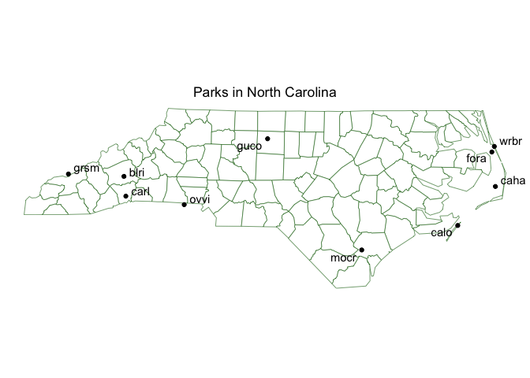

NPS API Vignette
================

- [Overview](#overview)
- [Requirements](#requirements)

# Overview

<figure>

<figcaption aria-hidden="true">parks</figcaption>
</figure>

# Requirements

``` r
get_NPS_activities <- function(key, activities){
  acts <- paste(activities, collapse = ",")
  url <- paste0("https://developer.nps.gov/api/v1/activities/parks?api_key=",
                key,
                "&q=",
                acts,
                "&limit=10000")
  
  query <- GET(url)
  results <- fromJSON(rawToChar(query$content))$data$parks
  
  activity <- c()
  for (i in 1:length(activities)){
    y <- rep(activities[i],
             nrow(results[[i]]))
    activity <- append(activity, y)
  }
  
  results <- results |>
    bind_rows() |>
    cbind(activity) |>
    select(fullName, activity, states)
  
  return(results)
}
```

``` r
a <- GET(paste0("https://developer.nps.gov/api/v1/activities?api_key=", myKey))
fromJSON(rawToChar(a$content))$data$name
```

    ##  [1] "Arts and Culture"      "Astronomy"            
    ##  [3] "Auto and ATV"          "Biking"               
    ##  [5] "Boating"               "Camping"              
    ##  [7] "Canyoneering"          "Caving"               
    ##  [9] "Climbing"              "Compass and GPS"      
    ## [11] "Dog Sledding"          "Fishing"              
    ## [13] "Flying"                "Food"                 
    ## [15] "Golfing"               "Guided Tours"         
    ## [17] "Hands-On"              "Hiking"               
    ## [19] "Horse Trekking"        "Hunting and Gathering"
    ## [21] "Ice Skating"           "Junior Ranger Program"
    ## [23] "Living History"        "Museum Exhibits"      
    ## [25] "Paddling"              "Park Film"            
    ## [27] "Playground"            "SCUBA Diving"         
    ## [29] "Shopping"              "Skiing"               
    ## [31] "Snorkeling"            "Snow Play"            
    ## [33] "Snowmobiling"          "Snowshoeing"          
    ## [35] "Surfing"               "Swimming"             
    ## [37] "Team Sports"           "Tubing"               
    ## [39] "Water Skiing"          "Wildlife Watching"

``` r
get_NPS_activities(myKey, c("climbing", "swimming")) |>
  group_by(fullName) |>
  filter(n() > 1) |>
  select(-activity) |>
  distinct(fullName, states)
```

    ## # A tibble: 9 × 2
    ## # Groups:   fullName [9]
    ##   fullName                                        states
    ##   <chr>                                           <chr> 
    ## 1 Acadia National Park                            ME    
    ## 2 Big South Fork National River & Recreation Area KY,TN 
    ## 3 Delaware Water Gap National Recreation Area     NJ,PA 
    ## 4 Glacier National Park                           MT    
    ## 5 Great Sand Dunes National Park & Preserve       CO    
    ## 6 Little River Canyon National Preserve           AL    
    ## 7 Olympic National Park                           WA    
    ## 8 Pictured Rocks National Lakeshore               MI    
    ## 9 Yosemite National Park                          CA

``` r
get_NPS_parks <- function(key, states = NULL){
  if(is.null(states)){
    url <- paste0("https://developer.nps.gov/api/v1/parks?api_key=",
                  key,
                  "&limit=10000")
  }
  
  if(!is.null(states)){
    url <- paste0("https://developer.nps.gov/api/v1/parks?api_key=",
                  key,
                  "&stateCode=",
                  paste(states, collapse = ","),
                  "&limit=10000")
  }

query <- GET(url)
results <- fromJSON(rawToChar(query$content))$data

return(results)
}
```

``` r
get_NPS_codes <- function(key) {
  url <- paste0("https://developer.nps.gov/api/v1/parks?api_key=",
                  key,
                  "&limit=10000")
  query <- GET(url)
  results <- fromJSON(rawToChar(query$content))$data
  results |>
    select(fullName, parkCode, states)
}

get_NPS_campgrounds <- function(key, park_code = NULL){
  parks <- get_NPS_codes(key)
  
  if(is.null(park_code)){
    url <- paste0("https://developer.nps.gov/api/v1/campgrounds?api_key=",
                  key,
                  "&limit=10000")
  }
  
  if(!is.null(park_code)){
    url <- paste0("https://developer.nps.gov/api/v1/campgrounds?api_key=",
                  key,
                  "&parkCode=",
                  park_code,
                  "&limit=10000")
  }
  
  query <- GET(url)
  camps <- fromJSON(rawToChar(query$content))$data |>
    select(name, parkCode) |>
    left_join(parks)
  results <- cbind(camps, fromJSON(rawToChar(GET(url)$content))$data$amenities)
  
  return(results)
}
```

``` r
library(ggplot2)
library(sf)

NC <- get_NPS_parks(myKey, "NC")

NC <- NC |>
  mutate(long = as.numeric(longitude), .keep = "unused") |>
  mutate(lat = as.numeric(latitude), .keep = "unused") |>
  filter(parkCode != "trte", parkCode != "appa")

nc <- st_read(system.file("shape/nc.shp", package="sf"))
```

    ## Reading layer `nc' from data source 
    ##   `/Library/Frameworks/R.framework/Versions/4.2-arm64/Resources/library/sf/shape/nc.shp' 
    ##   using driver `ESRI Shapefile'
    ## Simple feature collection with 100 features and 14 fields
    ## Geometry type: MULTIPOLYGON
    ## Dimension:     XY
    ## Bounding box:  xmin: -84.32385 ymin: 33.88199 xmax: -75.45698 ymax: 36.58965
    ## Geodetic CRS:  NAD27

``` r
ggplot(nc) +
  geom_sf(color = "darkgreen", fill = "white", size = 10) +
  geom_point(data = NC, mapping = aes(x = long, y = lat)) +
  ggrepel::geom_text_repel(data = NC, aes(x = long, y = lat, label = parkCode)) +
  theme_void() +
  labs(title = "Parks in North Carolina") +
  theme(plot.title = element_text(hjust = 0.5)) +
  xlab(NULL) + ylab(NULL)
```

<!-- -->
