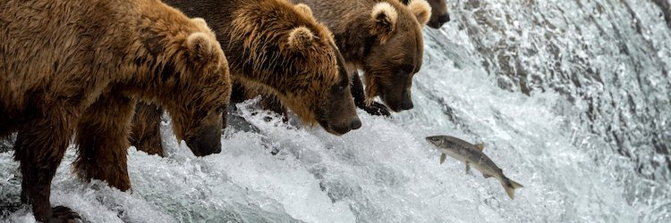

```{r setup, include=FALSE}
knitr::opts_chunk$set(echo = TRUE, message = FALSE, warning = FALSE, error = TRUE)

library(httr)
library(jsonlite)
library(dplyr)
library(stringr)
library(tidyr)
library(ggplot2)
library(sf)

my_key <- "oKmYKW6S1dOrI47ra4laE70chvKFy5WGV1c0Pjgo"
```


# Overview

This document demonstrates how to retrieve and summarize data from the United States National Parks Service (NPS) [API](https://www.nps.gov/subjects/developer/api-documentation.htm). The NPS API provides access to data about official NPS parks and their activities, campgrounds, events, photos, and more. In this vignette, I build functions to interact with four of the API's endpoints. I then use these functions to perform some exploratory data analysis.

# Requirements

To retrieve data from the NPS API you will need to sign up for a free API key at the [Get Started with the NPS API](https://www.nps.gov/subjects/developer/get-started.htm) web page.

Additional, helpful documentation about the NPS API is located [here](https://www.nps.gov/subjects/developer/api-documentation.htm). 

To develop my API interaction functions, I used the following packages:

`httr`

`jsonlite`

`dplyr`

In addition, I used the following packages to manipulate and visualize data:

`stringr`

`tidyr`

`ggplot2`

`sf`

# API Interaction Functions


## get_NPS_parks

This function interacts with the parks endpoint to retrieve NPS parks located in your state. The required input is `key` and the optional input is `states`, a character vector of two-letter state codes (e.g. `c("NC", "MI")`).

The output is a tibble of NPS parks. If no state(s) is supplied, the function will return parks in all states. There are numerous site designations within NPS (other than "National Park") and descriptions for each designation can be found [here](https://www.nps.gov/goga/planyourvisit/designations.htm).
3
```{r}
get_NPS_parks <- function(key, states = NULL){
  if(is.null(states)){
    url <- paste0("https://developer.nps.gov/api/v1/parks?api_key=",
                  key,
                  "&limit=10000")
  }
  
  else{
    url <- paste0("https://developer.nps.gov/api/v1/parks?api_key=",
                  key,
                  "&stateCode=",
                  paste(states, collapse = ","),
                  "&limit=10000")
  }

query <- GET(url)
results <- fromJSON(rawToChar(query$content))$data |>
  select(fullName, parkCode, states, designation, latitude, longitude) |>
  mutate(latitude = as.numeric(latitude), longitude = as.numeric(longitude)) |>
  as_tibble()

return(results)
}
```


## get_NPS_activities

This function interacts with the activities/parks endpoint to retrieve parks associated with your activities. The required inputs are `key` and `activities`, a character vector of activities (e.g. `c("Hiking", "Horse Trekking")`). The output is a tibble of NPS parks related to the input activities.

```{r}
get_NPS_activities <- function(key, activities){
  acts <- paste(activities, collapse = ",")
  acts <- sub(" ", "%20", acts)
  
  url <- paste0("https://developer.nps.gov/api/v1/activities/parks?api_key=",
                key,
                "&q=",
                acts,
                "&limit=10000")
  
  query <- GET(url)
  results <- fromJSON(rawToChar(query$content))$data$parks
  
  activity <- c()
  for (i in 1:length(activities)){
    y <- rep(activities[i],
             nrow(results[[i]]))
    activity <- append(activity, y)
  }
  
  results <- results |>
    bind_rows() |>
    cbind(activity) |>
    select(fullName, parkCode, states, activity) |>
    as_tibble()
  
  return(results)
}
```

For reference, here are the categories of activities defined by NPS:

```{r}
get_activities <- GET(paste0("https://developer.nps.gov/api/v1/activities?api_key=",
                             my_key))
NPS_activities <- fromJSON(rawToChar(get_activities$content))$data$name
NPS_activities
```


## get_NPS_campgrounds

This function interacts with the campgrounds endpoint to retrieve data about amenities at campgrounds in your park.

The preceding function, `get_NPS_codes`, retrieves park codes for all parks. It can be used to look up the official code for your park and is used in the main campgrounds function to join park names by `parkCode`. 

Below, I look up the `parkCode` for each of my parks of interest -- Joshua Tree and the New River Gorge.

```{r}
get_NPS_codes <- function(key) {
  url <- paste0("https://developer.nps.gov/api/v1/parks?api_key=",
                key,
                "&limit=10000")
  query <- GET(url)
  results <- fromJSON(rawToChar(query$content))$data
  results |>
    select(fullName, parkCode, states) |>
    as_tibble()
}
```

```{r}
library(stringr)
all_codes <- get_NPS_codes(my_key) 
my_codes <- all_codes |>
  filter(str_detect(fullName, "Joshua Tree|New River"))
my_codes
```

Now for the `get_NPS_campgrounds` function, the required input is `key` and the optional input is `park_codes`, a character vector of park codes (e.g. `c("jotr", "neri")`).

```{r}
get_NPS_campgrounds <- function(key, park_codes = NULL){
  parks <- get_NPS_codes(key)
  
  if(is.null(park_codes)){
    url <- paste0("https://developer.nps.gov/api/v1/campgrounds?api_key=",
                  key,
                  "&limit=10000")
  }
  
  if(!is.null(park_codes)){
    url <- paste0("https://developer.nps.gov/api/v1/campgrounds?api_key=",
                  key,
                  "&parkCode=",
                  paste(park_codes, collapse = ","),
                  "&limit=10000")
  }
  
  query <- GET(url)
  camps <- fromJSON(rawToChar(query$content))$data |>
    select(name, parkCode) |>
    left_join(parks, by = "parkCode")
  results <- cbind(camps, fromJSON(rawToChar(GET(url)$content))$data$amenities)|>
    as_tibble()
  
  return(results)
}
```

## get_NPS_fees

This function interacts with the feespasses endpoint to retrieve data on fees associated with your park. The required inputs are key an park_codes, a character vector of park codes (e.g. `c("jotr", "neri")`).

```{r}
get_NPS_fees <- function(key, park_codes){
  url <- paste0("https://developer.nps.gov/api/v1/feespasses?api_key=",
                key,
                "&parkCode=",
                paste(park_codes, collapse = ","),
                "&limit=10000")
  query <- GET(url)
  results <- fromJSON(rawToChar(query$content))$data$fees |>
    bind_rows()
  
  if(length(results) > 0){
    results <- results |>
      select(entranceFeeType, cost, description) |>
      mutate(cost = as.numeric(cost))
  }
  
  else{
    stop(message = "No fees!")
  }
  
  return(results)
}
```

# Exploratory Data Analysis



## NPS parks in NC

First, let's pull data on all NPS parks in North Carolina using the `get_NPS_parks` function.

```{r}
NC_parks <- get_NPS_parks(my_key, "NC")
NC_parks
```

### Which designation categories are represented by NC's NPS parks?

North Carolina has twelve NPS parks in total. It turns out it's a pretty diverse set of parks as well, including nine unique designations.

```{r}
NC_parks |>
  group_by(designation) |>
  summarise(count = n()) |>
  arrange(desc(count))
```

### Where are NC's NPS parks located?

The data pull from `get_NPS_parks` includes information on latitude and longitude coordinates for each park. I use this data to plot the parks on a map of NC below. I exclude the Trail Of Tears National Historic Trail and the Appalachian National Scenic Trail since their recorded geographic coordinates lie outside the state.

```{r}
NC <- NC_parks |>
  filter(parkCode != "trte", parkCode != "appa")

NC_map <- st_read(system.file("shape/nc.shp", package="sf"), quiet = TRUE)
ggplot(NC_map) +
  geom_sf(color = "seagreen3", fill = "honeydew", linewidth = 0.3) +
  geom_point(data = NC, mapping = aes(x = longitude,
                                      y = latitude),
             color = "grey20",
             shape = 17,
             size = 3) +
  ggrepel::geom_text_repel(data = NC, aes(x = longitude,
                                          y = latitude,
                                          label = parkCode),
                           size = 5) +
  labs(title = "NPS Parks in North Carolina") +
  xlab(NULL) + ylab(NULL) +
  theme(plot.title = element_text(hjust = 0.5, size = 20))
```
## National NPS Statistics

Let's use the `get_NPS_parks` function again to pull data on all NPS parks. This time, I don't specify a state and retrieve data on all NPS parks in the nation.

```{r}
all_parks <- get_NPS_parks(my_key)
all_parks
```

### Nationally, which NPS designation categories have the most parks?  

The National Monument and National Historic Site categories have the most NPS units, followed by National Historical Park, National Park, and National Historic Trail. I plot counts for these top five designations below.

```{r}
all_des <- all_parks |>
  group_by(designation) |>
  filter(!designation == "") |>
  summarise(count = n()) |>
  arrange(desc(count))

all_des
```

```{r}
all_des_5 <- all_des |>
  slice(1:5)

ggplot(data = all_des_5, aes(x = reorder(designation, count))) +
         geom_col(aes(y = count), color = "seagreen1", linewidth = 1.5, fill = "seagreen4") +
  xlab(NULL) +
  ylab("count") +
  labs(title = "NPS parks by Designation: Top 5") +
  coord_flip()
```
### Which states have the most National Monuments?

The National Monument designation category has the most NPS units, therefore I break down the total count of National Monuments by state in the summary table below. The southwest region of the country has the highest concentration of monuments. Arizona leads the count with thirteen monuments, and is followed by New Mexico with nine monuments.

```{r}
all_parks |>
  filter(designation == "National Monument") |>
  separate_rows(states) |>
  group_by(states) |>
  summarise(count = n()) |>
  arrange(desc(count)) |>
  slice(1:10)
```

## NPS parks with Climbing and Swimming

Next, let's use the `get_NPS_activities` function to pull data on all parks with "Climbing" and/or "Swimming" recorded as possible activities.

```{r}
climb_swim <- get_NPS_activities(my_key, c("Climbing", "Swimming"))
climb_swim
```
### How many parks have climbing, and how many parks have swimming?

52 NPS parks have swimming listed as a possible activity, and 39 parks have climbing listed as a possible activity.

```{r}
climb_swim |>
  group_by(activity) |>
  summarise(count = n())
```

### Which states have the most NPS parks with climbing availability? And swimming?

Alaska is unsurprisingly dominated by climbing destinations. California has the highest number of total parks, with an even mix of climbing and swimming availability. Unfortunately, North Carolina has no parks with climbing availability, but only swimming. It's a good thing we have have great state parks for climbing!


```{r}
climb_swim_states <- climb_swim |>
  separate_rows(states, sep = ",")

ggplot(data = climb_swim_states, aes(x = states)) + 
  geom_bar(aes(fill = activity)) +
  scale_fill_manual(values = c("grey20", "turquoise3")) +
  theme(axis.text.x = element_text(angle = 90)) +
  xlab("state") +
  labs(title = "NPS parks with Climbing and/or Swimming by State")
```

### Which NPS parks have BOTH climbing and swimming recorded as possible activities?

Only nine parks have both climbing and swimming!

```{r}
climb_and_swim <- climb_swim |>
  group_by(fullName) |>
  filter(n() > 1) |>
  select(-activity) |>
  distinct(fullName, states)

climb_and_swim
```
## Campground Amenities at grsm

I want to visit Great Smoky Mountains National Park. Let's use the `get_NPS_camgrounds` function to see how many campgrounds the park has available.

```{r}
get_NPS_codes(my_key) |>
  filter(str_detect(fullName, "Great Smoky"))
```

Great Smoky Mountains National Park has 13 campgrounds recorded.

```{r}
my_camps <- get_NPS_campgrounds(my_key, "grsm")
my_camps |>
  select(name)
```

### Which of the Great Smoky Mountains campgrounds have the best amenities? 
 
I choose the following amenities to investigate: cell phone reception, potable water, bathrooms, trash/recycling collection, camp store, food storage lockers, and firewood. I code no availability as 0, seasonal availability as 0.5, and year round availability as 1 and create a heat map with `geom_tile()`. Based on the results, it seems Cades Cove Campground/Group Campground offer the most amenities at any time of year.

```{r}
my_camps_heat <- my_camps |>
  slice(1:12) |>
  select(name,
         cellPhoneReception,
         potableWater,
         toilets,
         trashRecyclingCollection,
         campStore,
         foodStorageLockers,
         firewoodForSale) |>
  mutate(potableWater = unlist(potableWater)) |>
  mutate(toilets = unlist(toilets)) |>
  pivot_longer(!name, names_to = "var", values_to = "value") |>
  mutate(value = recode(value, 
                        "No" = "0",
                        "No water" = "0",
                        "Yes - year round" = "1",
                        "Yes - seasonal" = "0.5",
                        "Flush Toilets - year round" = "1",
                        "Flush Toilets - seasonal" = "0.5")) |>
  mutate(value = as.numeric(value))

ggplot(my_camps_heat, aes(x = name, y = var, fill = value)) +
  geom_tile() +
  scale_fill_gradient(low = "black", high = "turquoise1", name = "") +
  theme(axis.text.x = element_text(angle = 45, hjust = 1)) +
  xlab(NULL) + ylab(NULL) +
  labs(title = "Campground Amenities:
Great Smoky Mountains National Park")
```

## Entrance Fees

### Does Great Smoky Mountains National Park have entrance fees?

Finally, let's use the `get_NPS_fees` to pull entrance fees for grsm. Good news...no fees!

```{r}
get_NPS_fees(my_key, "grsm")
```

### Does Yosemite National Park have entrance fees?

Let's try another park. It looks like Yosemite has entrance fees for all visitors with the exception of Education/Academic Groups.

```{r}
get_NPS_fees(my_key, "yose")
```

### On avergae, what is the cost of non-commerical, non-group entrance to NPS parks?

I use the `get_NPS_fees` function to pull data on fees for all park codes. The function will exclude parks that don't have any fees listed.

```{r}
all_codes <- as.vector(get_NPS_codes(my_key)$parkCode)

fees <- get_NPS_fees(my_key, all_codes) |>
  select(entranceFeeType, cost) |>
  filter(entranceFeeType == "Entrance - Private Vehicle"|
           entranceFeeType == "Entrance - Motorcycle"|
           entranceFeeType == "Entrance - Per Person"
  )
```

The average entrance fee, among all parks that have fees, is highest for private vehicles at 25.8 dollars.

```{r}
fees |>
  group_by(entranceFeeType) |>
  summarise(averageCost = mean(cost), sdCost = sd(cost))
 
```

Per person entrance is typically between 10 and 15 dollars and has the smallest variance among the three individual entrance types, with a few outliers at 0 and 30 dollars.

```{r}
ggplot(data = fees, aes(x = entranceFeeType, y = cost)) +
  geom_boxplot(aes(fill = entranceFeeType)) +
  xlab(NULL) +
  theme(axis.text.x = element_blank()) +
  scale_fill_manual(values = c("seagreen2", "deeppink2", "turquoise2"), name = "Fee Type") +
  labs(title = "NPS Fees by Type of Entrance")
```

